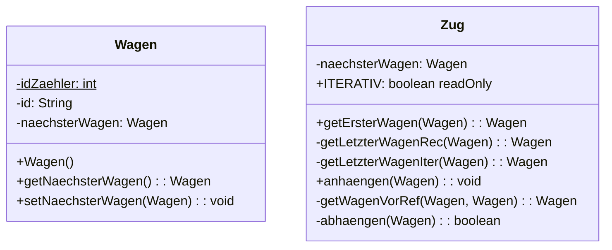

```mermaid
classDiagram
class Wagen{
-idZaehler: int$
-id: String
-naechsterWagen: Wagen
+Wagen()
+getNaechsterWagen(): Wagen
+setNaechsterWagen(Wagen): void
}

class Zug{
-naechsterWagen: Wagen
+ITERATIV: boolean readOnly
+getErsterWagen(Wagen): Wagen
-getLetzterWagenRec(Wagen): Wagen
-getLetzterWagenIter(Wagen): Wagen
+anhaengen(Wagen): void
-getWagenVorRef(Wagen, Wagen): Wagen
-abhaengen(Wagen): boolean
}
```

